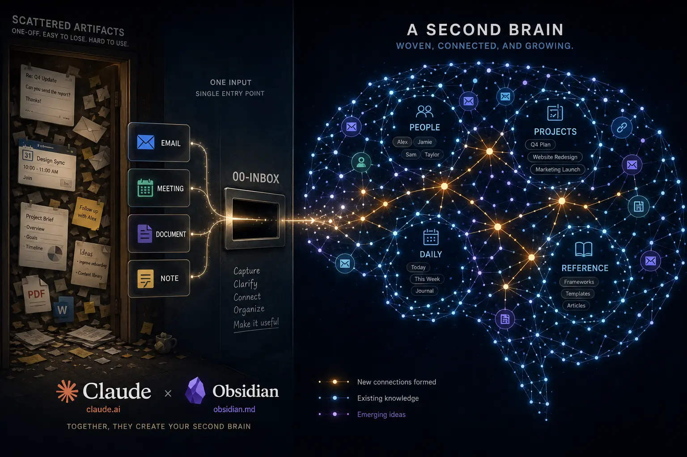

# Claude + Obsidian Vault = Second Brain

[](LICENSE)   



An Obsidian vault wired to [Claude Code](https://claude.com/claude-code) skills that automate a knowledge worker's working notes. Drop emails, meeting transcripts, and documents into a folder (`00-Inbox/`); the system classifies them, resolves people and projects to wikilinks, writes structured interaction notes, and generates a daily briefing. It also handles weekly/monthly reviews, 1on1 prep, and project status.

It ships with a **product-management preset** (products, markets, segments, OKRs, steering-committee meetings) that you can turn off during setup, leaving a general working-notes vault for anyone who runs projects and meetings.

This repository is a **sanitized, generic copy** of a real working system. All names, companies, emails, and data are fictional examples (the persona "Sam Rivera" at "Acme Corp"). Nothing here is anyone's real data. Make it yours by running `/w-setup` (see below).

## Contents

- [What it does](#what-it-does)
- [How it works](#how-it-works)
- [Skills](#skills)
- [Requirements](#requirements)
- [Getting started](#getting-started)
- [Your data](#your-data)
- [Example content](#example-content)
- [Configuration](#configuration)
- [What you can drop into the inbox](#what-you-can-drop-into-the-inbox)
- [Expect to tune it](#expect-to-tune-it)
- [Repository layout](#repository-layout)
- [FAQ](#faq)
- [License](#license)

## What it does

- **Email ingestion**: parses captured emails, cleans signatures/footers/disclaimers, scores relevance (high/medium/low), consolidates threads, and writes interaction notes.
- **Meeting transcripts**: turns transcripts (from any recorder, or [Plaud](https://www.plaud.ai/)) into concise meeting notes with attendees, decisions, and action items.
- **Document processing**: converts PDF/DOCX/PPTX/XLSX/HTML into reference notes (PDF, HTML, images, and text work with zero extra installs; see Requirements).
- **Daily briefings**: an AI-generated scan layer over the day's ingestion, linking to source notes.
- **Periodic reviews**: weekly, monthly, or custom-window reviews of activity, decisions, and open actions.
- **Entity registry**: a single source of truth (`_db/entity-registry.json`) that resolves people, projects, products, and markets to wikilinks, with an optional VIP-tier system that boosts relevance for your management chain and key stakeholders.

The full architecture, data flows, and per-script reference live in [`.claude/SYSTEM.md`](.claude/SYSTEM.md).

## How it works

One file makes the trip from inbox to a linked note in five steps:

```
00-Inbox/         you drop emails, transcripts, docs, or notes
    |
    v
classify          detect the type by content (email / transcript / document / note)
    |
    v
resolve entities  match names and emails to [[wikilinks]] via _db/entity-registry.json
    |
    v
write notes       structured interaction notes in 05-Interactions/, reference docs in 08-Reference/
    |
    v
daily briefing    an AI scan layer in 01-Daily/ that links back to every source note
```

Python scripts in `_scripts/` do the deterministic work (classification, entity resolution, note writing, index building). Claude does the judgment work (summarizing, scoring relevance, extracting actions, writing the briefing). `/w-daily` is the single entry point that runs the whole chain.

## Skills

Every user-invocable skill is a Claude Code slash command. Run them from Claude Code with the vault folder open.

| Command | What it does |
|---------|--------------|
| `/w-setup` | One-time (re-runnable) wizard: interviews you, then writes your identity, org, VIP roster, projects, and integrations into every config surface. |
| `/w-daily` | The master command. Ingests the inbox, creates the daily note, and writes the AI briefing. |
| `/w-review [period]` | Weekly, monthly, or custom-window review (`weekly`, `monthly 2026-02`, `last 30 days`, `project:Name last 2 weeks`). |
| `/w-1on1 [person]` | Preps a 1on1: last meeting notes, open items, talking points, into a pre-populated meeting note. |
| `/w-prep [person/topic]` | Conversation prep (forward) or a "what I did on X" recap (retro). |
| `/w-project-status [name]` | Recent activity, decisions, blockers, and OKR linkage for one project or product. |
| `/w-task-audit` | Action-item hygiene: fixes missing tags, strips noise tasks, reports task health. |

## Requirements

- **Obsidian** with these community plugins: Dataview, Templater, Tasks, Calendar, Periodic Notes, QuickAdd, Omnisearch, Linter, Icon Folder, Homepage, Obsidian Git. The enabled list ships in `.obsidian/community-plugins.json`, but neither the plugin code nor its settings are committed (both live under the gitignored `.obsidian/plugins/`), so you install and configure them yourself. Also enable the core **Bases** plugin (Settings → Core plugins) for the `_bases/` views; it is recent, so update Obsidian if you don't see it. See **[docs/plugins.md](docs/plugins.md)** for what each plugin does, which are essential, and the few settings to reapply. None of them are needed for Claude to run; they are for the Obsidian reading and authoring experience.
- **Claude Code**, signed in to an Anthropic account. The `/w-*` skills are Claude sessions and use your plan/quota like any other Claude session (see [Your data](#your-data) on cost).
- **Python 3.10+** for the `_scripts/` pipeline. The core pipeline is **standard library only**, no third-party packages required.
- **Document conversion (optional, degrades gracefully):** PDF, HTML, images, and text process with **zero installs** (Claude reads them natively). `pip install markitdown` adds DOCX/PPTX/XLSX; a `defuddle` install gives cleaner HTML. Run `python _scripts/check-environment.py` to see what's installed and what each tool adds.
- **Optional sources:** a [Plaud](https://www.plaud.ai/) device (or any recorder that drops transcript files into `00-Inbox/`), and Windows + Power Automate + OneDrive for automated email capture (`_scripts/Pull-Emails.ps1`). If you don't use these, the related steps simply no-op on every run, nothing to configure.

## Getting started

1. Clone this repo and open the folder as a vault in Obsidian.
2. Install the community plugins (see [docs/plugins.md](docs/plugins.md)) and reapply their vault-specific settings, then reload Obsidian. Until you do, Dataview and Bases blocks render empty or as raw code; that's expected and resolves once the plugins are on.
3. Open the folder in Claude Code (it reads `CLAUDE.md` and `.claude/`). `CLAUDE.md` is the operating manual the agent reads on every session; `/w-setup` fills in the parts that are about you.
4. **Run `/w-setup`** in Claude Code. It interviews you and configures everything (your identity, org, VIP roster, projects, the PM preset on/off, and any integrations).
5. Drop a file into `00-Inbox/` and run `/w-daily` (or copy a ready-made sample from `_examples/inbox-samples/` first, see [Example content](#example-content)).

The vault root is auto-detected by the scripts (they resolve it from their own location in `_scripts/`), so there are no absolute paths to edit.

## Your data

This is your working notes, so it's worth being clear about where they go.

- **It's plain Markdown on your disk.** No database, no hosted service. Stop using this tomorrow and you keep every note. Sync the vault however you sync files: Obsidian Sync, iCloud, Syncthing, Dropbox, or the Obsidian Git plugin.
- **The skills send note content to Anthropic.** The `/w-*` commands run in Claude Code, which means the inbox files and notes they process go to Anthropic like any Claude session. Before that, `classify-inbox.py --sanitize-pii` replaces email addresses and phone numbers **in email bodies** with tokens (`[EMAIL-xxxx]`, `[PHONE-xxxx]`); the mapping stays local in `_db/sanitize-mappings.json`. It does not tokenize headers (needed to resolve who's who) or transcripts, so treat it as reducing exposure, not removing it.
- **Git is configured to keep your content local.** The repo tracks structure, skills, templates, and `entity-registry.json`. The `.gitignore` keeps the rest out: `00-Inbox/`, `_attachments/`, the runtime `_db/*.json` and logs (which hold real emails, phone numbers, and subjects), and `.env`. If you push this vault to a remote, your captured content does not go with it. Read `.gitignore` before pointing it at a public remote anyway.
- **Ingestion consumes the inbox.** Once a note exists, processed emails and converted documents are **deleted** from `00-Inbox/`; transcripts move to `_attachments/`. The note is a structured summary, so don't drop your only copy of something irreplaceable. (Emails pulled from OneDrive keep their originals in a `Processed/` subfolder.)
- **Running it costs Claude usage.** A `/w-daily` over a busy inbox is many model calls, not a free local script. It draws on your Claude Code plan or quota.

## Example content

To show what each skill and script produces, the vault ships **seeded with a small, connected example dataset** built around the fictional persona (Sam Rivera, a PM at Acme Corp launching a product called Orion). It is one coherent week of work: a people roster, an org (products, markets, a segment, a team, a department, a partner), projects and a workstream, a quarterly OKR, meetings (1on1, steerco, sync), emails (a HIGH note, a condensed MEDIUM note, a consolidated thread), an async thread, a reference doc, a daily note with its AI briefing, and weekly + monthly reviews, all cross-linked the way the real system links them.

Every seeded file is marked with an Obsidian callout at the top so you can always tell demo content from your own:

> [!example] Example <thing> (output of <skill/script>). Fictional demo data. Replace or delete.

Raw **input** samples (the files you would drop into the inbox) live in [`_examples/inbox-samples/`](_examples/inbox-samples/) with their own README; copy them in and run `/w-daily` to watch the pipeline run end to end.

Find every example file:

```bash
grep -rln '\[!example\]' . --exclude-dir=.git
```

Start clean instead (removes the seeded demo content, keeps templates, scripts, skills, and config):

```bash
grep -rln '\[!example\]' 01-Daily 03-Projects 04-People 05-Interactions 07-Areas 08-Reference | xargs rm -f
rm -rf _examples
```

This also removes the example owner and manager notes; the fastest way to repopulate them around *your* details is to run `/w-setup`, which rebuilds `_db/entity-registry.json` and the owner/manager/project notes.

The shell snippets in this README assume a Unix shell (macOS, Linux, WSL, or git-bash). On plain Windows PowerShell, search the vault for `[!example]` in Obsidian instead, or just ask Claude to find and delete the example files.

## Configuration

The fastest path is **`/w-setup`** (Claude Code): it interviews you and writes every config surface in one pass, so you never hand-edit Python or JSON. To configure by hand instead, the surfaces are:

| What | Where | Change |
|------|-------|--------|
| Your identity (slug, name, company, emails, timezone) | `_scripts/utils.py` → the `OWNER CONFIG` block | Single source of truth; every script imports from here. |
| Your identity, role, manager (for Claude's context) | `CLAUDE.md` → `## About me` | Free-text block Claude reads. |
| People and VIP roster | `_db/entity-registry.json` | Add your people; set `vip` to `boss-chain`, `stakeholder`, or `team`. |
| VIP tier definitions | `.claude/rules/vip.md` | Document who is in each tier and how relevance boosts apply. |
| Email domain → company map | `_scripts/utils.py` → `company_from_domain()` | Map your org's domains to company names. |
| Example content (people, org, projects, interactions, reviews) | files marked with an `[!example]` callout, see [Example content](#example-content) | Replace, or bulk-delete to start clean. |
| Obsidian bookmark | `.obsidian/bookmarks.json` | Points at the example owner note; repoint or clear. |
| Plaud API credentials | copy `_scripts/.env.example` → `_scripts/.env` | Only if you use Plaud. Never commit `.env`. |
| Email capture folders | `_scripts/Pull-Emails.ps1` | Only if you use the Windows/OneDrive email pull. |

To find any remaining placeholders:

```bash
grep -rIn "Sam-Rivera\|Sam Rivera\|Acme\|sam.rivera" . --exclude-dir=.git
```

(The `.claude/` skill docs use "Sam" as a teaching example on purpose; those are fine to leave.)

## What you can drop into the inbox

Anything: copy-pasted notes, downloaded files, saved emails, transcripts, PDFs, Office documents. The classifier routes by content, not by folder:

- Emails (`.txt`/`.eml`/`.msg`) → interaction notes
- Transcripts (structured header or timestamped speaker lines) → meeting notes
- Documents (PDF/DOCX/PPTX/XLSX/HTML) → reference notes
- Markdown notes → merged into the daily note or routed as meeting notes
- Anything else → a reference note (the catch-all)

You don't need to pre-create subfolders. For an unusual file type or custom routing, just ask Claude to extend the detection rules in `.claude/rules/ingestion.md`.

## Expect to tune it

This is one person's opinionated setup, shared as a starting point. On a different machine or workflow, some skills may run slowly or surface errors the first few times, especially the larger ones tuned to a specific cadence. That is expected. After your first couple of `/w-daily` runs, ask Claude in plain language to fix, simplify, remove, or adapt any skill or script to how you actually work. The system is meant to be reshaped, not used as-is.

The `w-` prefix on every skill is a personal namespace: it keeps your own skills grouped and easy to invoke, and avoids collisions with other Claude Code plugins. Rename it if you prefer (rename the folders under `.claude/skills/` and update the references).

## Repository layout

```
00-Inbox/         Queue for emails, docs, transcripts, manual notes
01-Daily/         Daily notes + weekly/monthly reviews
03-Projects/      Projects and workstreams
04-People/        Person notes (example roster; one is a stub)
05-Interactions/  Email and meeting notes (year subfolders)
07-Areas/         Organization, OKRs, and the Dashboard cockpit (home note + operational Bases)
08-Reference/     Converted documents
09-Archive/       Completed work
_attachments/     Raw transcripts and source files
_examples/        Seeded demo dataset + inbox input samples
_templates/       Obsidian/Templater note templates
_bases/           Reusable Bases views embedded into entity notes (person/project/product/market/OKR)
_scripts/         Python + PowerShell automation pipeline
_db/              Entity registry, logs, indexes
.claude/          Claude Code skills, rules, and SYSTEM.md
assets/           README image(s)
docs/             Extra documentation (plugin setup)
```

## FAQ

**Do I need Windows, OneDrive, or a Plaud device?** No. Those drive the optional automated capture. Without them, you drop files into `00-Inbox/` by hand and everything else works the same.

**Will it send my notes to a cloud?** The skills process them through Anthropic, like any Claude session; PII in email bodies is tokenized first. See [Your data](#your-data) for what is and isn't covered.

**Does it cost money to run?** It uses your Claude Code plan or quota. A daily run over a full inbox is many model calls. See [Your data](#your-data).

**What if I stop using it?** It's plain Markdown in folders. Keep the vault, drop the skills, lose nothing.

## License

Released under the [MIT License](LICENSE).
